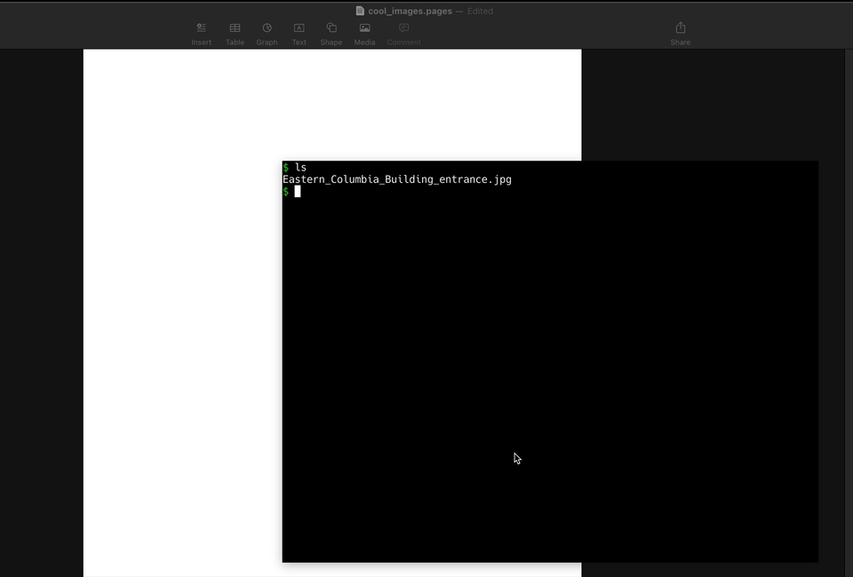

# gcopy


`gcopy` (global copy) is a command line tool that copies data to your clipboard on MacOS. It's similar to `pbcopy` but with some key differences

* Works with images, so copied images can be pasted
* Accepts arbitrary `STDIN` via a pipe, or directly a file as an argument
* Written in Go, deployed as a universal static binary





# Install

For both intel and Apple silicon:

```shell
curl -sL -o gcopy 'https://github.com/TheDen/gcopy/releases/latest/download/gcopy' && chmod +x gcopy && mv gcopy /usr/local/bin/
```

For specific archicture download

* `https://github.com/TheDen/gcopy/releases/latest/download/gcopy-darwin-arm64` (Apple silicon)
* `https://github.com/TheDen/gcopy/releases/latest/download/gcopy-darwin-amd64'` (intel)

## Usage

### Copying to clipboard via pipes

Works with ascii text or arbitrary data

```shell
cat main.go | gcopy
```

Images can also be copied via pipes, and then pasted as images


```shell
cat image.png | gcopy
```


### Passing in files to copy to the clipboard

```shell
gcopy main.go
```

Similarly for images

```shell
gcopy image.png
```
